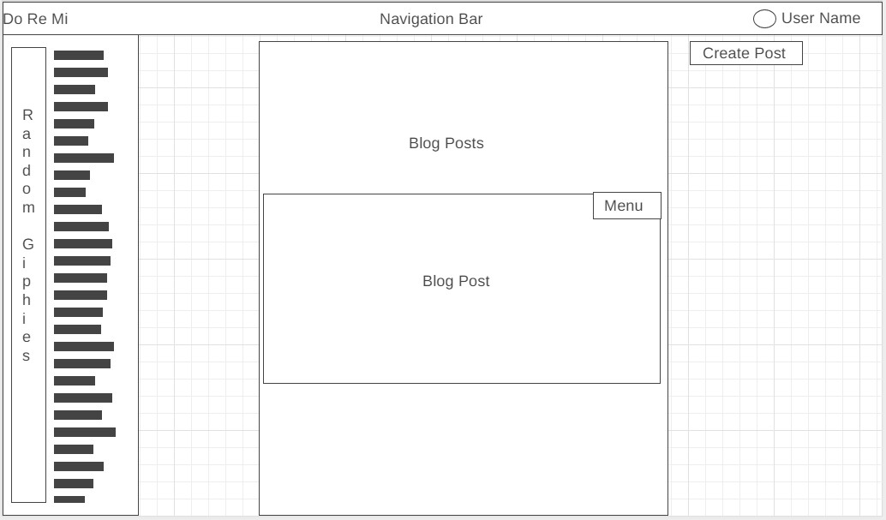
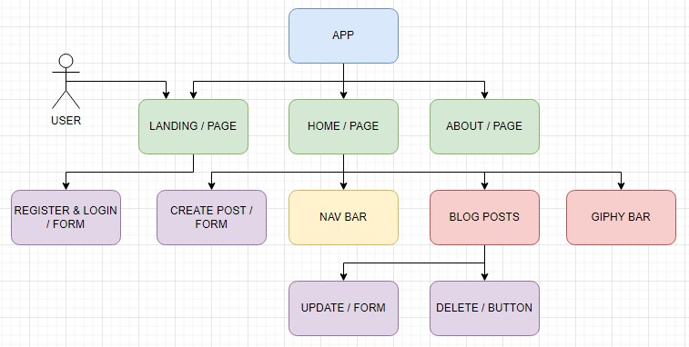

# Full-stack Blog App

This is a simple blog app. Users can make, read, update, and delete posts.

This is what was planned for the home page layout.

This is the plan for the flow of the pages and components.

## Technologies Used

### Back-end

- Node.js
- Express
- Swagger (for documentation)

### Front-end

- React

### Dependencies

| Dependency         | Version |
| ------------------ | ------- |
| bcrypt             | 5.0.1   |
| cors               | 2.8.5   |
| dotenv             | 16.0.1  |
| express            | 4.18.1  |
| express-validator  | 6.14.1  |
| helmet             | 5.1.0   |
| jsonwebtoken       | 8.5.1   |
| mongoose           | 6.3.8   |
| morgan             | 1.10.0  |
| swagger-jsdoc      | 6.2.1   |
| swagger-ui-express | 4.4.0   |

## Approach Taken

I started by trying to break the project into smaller pieces.

- Declare the routes needed
- Build the router for each main route that included all of the CRUD functionalities
- Add any middleware and config files needed
- Build the Schemas
- Create an app with React
- Create the pages
- Create the forms
- Create the components
- Style the UI

## Unsolved Problems

- Changed from the original plan to have one update button to have an update button on each post
- Create a menu button that houses the delete and update buttons
- Get the Update form to work
- Private blog page that only shows the users blogs

## Link to Hosted Site

## Installation Instructions

No install needed

## User Story

As a blog user, I want to share my story, so that others can share in my experiences.

## Notes to Self

- Make the page more responsive
- Find something to put on the right side of the page for balance.
